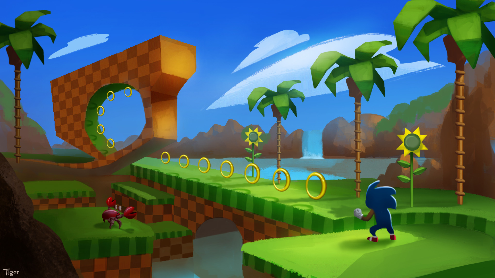

# Supersonic
### __Multiworker Deep RL Agent for OpenAI Gym and Gym Retro__

Supersonic is an implementation of __[Proximal Policy Optimization with Random Network Distillation](https://arxiv.org/abs/1810.12894)__, written in eager-execution TensorFlow and with support for multiple workers on high cpu machines or clusters.

To train an agent on the Sonic level 'Green Hill Zone Act1':
```shell
mpiexec -n 32 python train.py --lvl GreenHillZone.Act1
```

#### Setup and Installation
1. Clone this repository with `git clone -r https://github.com/jakegrigsby/supersonic.git`

2. Install the package
```shell
    cd supersonic
    pip install -e . 
```

3. Install other dependencies
```shell
    pip install -r requirements.txt
```

5. If you want to train on Sonic, you'll need to buy the ROMs and install them on your system. See the [retro contest details](https://contest.openai.com/2018-1/details/) for more instructions. __After installing the ROMs, you can run the included `./set_up_correct_reward_funcs.sh` to switch out the default reward function for the correct one used by the Retro Contest.__

#### Adding New Environments
Supersonic can run in any OpenAI Gym or Gym-Retro environment (assuming you have the ROMs) out of the box. However, it's common practice to use 'wrappers' around the environment, which do things like clip the reward, reshape the observation or convert the frames to grayscale. __Defaults are included for [all of the v0 pixel-only atari 2600 environments](https://gym.openai.com/envs/#atari), (84x84 grayscaling, normalizing, frameskipping and 'sticky' actions) as well as all of the Sonic levels.__ (see data/sonic-train.csv and data/sonic-val.csv for a list of those options). Support for consecutive Sonic levels is included (see `environment.Gauntlet` and `environment.greenhillzonecomplete`). Also comes with defaults for [gym-super-mario-bros](https://github.com/Kautenja/gym-super-mario-bros).


To add your own custom wrappers, write a function in `environment.py` that returns the wrapped environment, using any of the wrappers included in that file (or added by you). Then use the `env_builder` decorator with the key for that environment. This will be what you enter from the command line to train on that wrapped environment. Here's an example:
```python
@env_builder('VeryCustomEnvironment-v100')
def build_myenv(lvl):
    env = base_env(lvl)
    env = WarpFrame(env)
    env = MaxAndSkipEnv(env, skip=4)
    env = RewardScaler(env)
    env = StickyActionEnv(env)
    env = FrameStackWrapper(env)
    return env
```
You should then be able to train on your environment by running
```mpiexec -n 4 python train.py --lvl VeryCustomEnvironment-v100```

#### Training Agents
Training is launched from the command line using the command:
```shell
mpiexec -n *num of workers* python train.py --lvl *env name*
--logdir *path to write logs* --rollouts *num of rollouts*
```
Weights are saved in the `weights` directory under a folder with the same name as the `--logdir` you specify.

An additional flag, `--render` can be added if you want to watch training live. This is an int that determines how many of the
parallel environments are rendered. So `mpiexec -n 128 python train.py --render 1` trains with 128 workers but will only render
1 of them.

At this time, supersonic can only run multiple workers using the cpu version of TensorFlow. It uses synchronous gradient descent to distribute computation and increase performance.

#### Testing Agents
```shell
python test.py --lvl *env name* --weights *path to correct weights dir* --episodes *num of episodes*
```
An example would be `python test.py --lvl GreenHillZone.Act1 --weights GreenHillZoneAct1/checkpoint_9500`. The additional flags `--record` and `--record_path` are a bool and str that let gameplay footage be recorded and saved to the specified directory.

#### References

##### Papers:
Schulman, John, et al. "Proximal policy optimization algorithms." arXiv preprint arXiv:1707.06347 (2017).

Burda, Yuri, et al. "Exploration by random network distillation." arXiv preprint arXiv:1810.12894 (2018).

Chen, Jianmin, et al. "Revisiting distributed synchronous SGD." arXiv preprint arXiv:1604.00981 (2016).

##### Repositories:
[openai/random-network-distillation](https://github.com/openai/random-network-distillation)

[jcwleo/random-network-distillation-pytorch](https://github.com/jcwleo/random-network-distillation-pytorch)

[openai/spinningup](https://github.com/openai/spinningup)

[openai/baselines](https://github.com/openai/baselines)


--------------------------------------------------------------------

_Developed by students at the University of Virginia, 2019._

_[UVA Data Science Institute](https://datascience.virginia.edu)_

_[UVA Advanced Research Computing Services](https://arcs.virginia.edu)_


